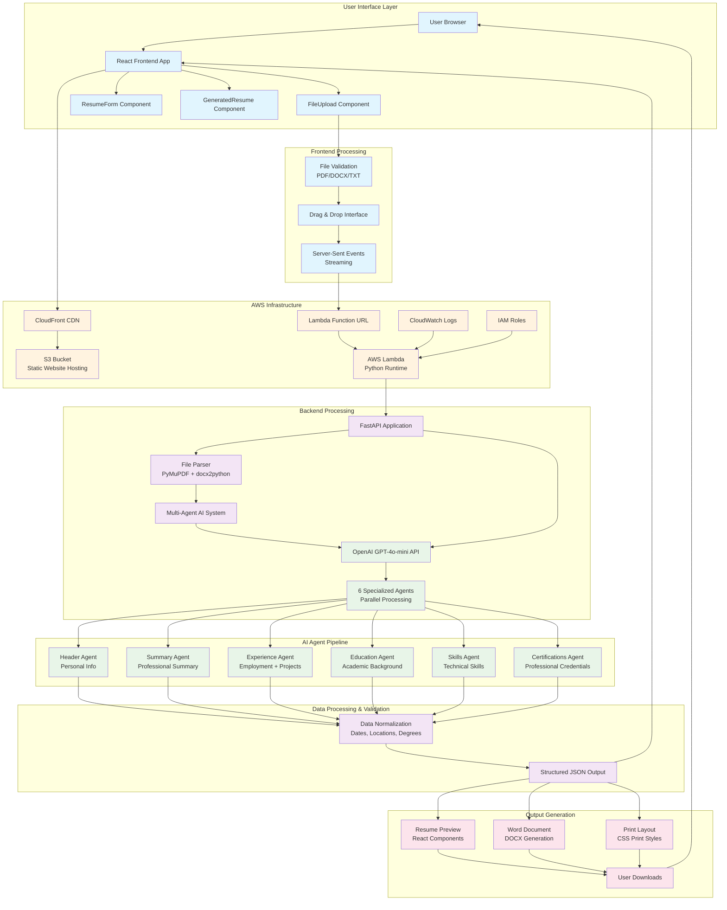
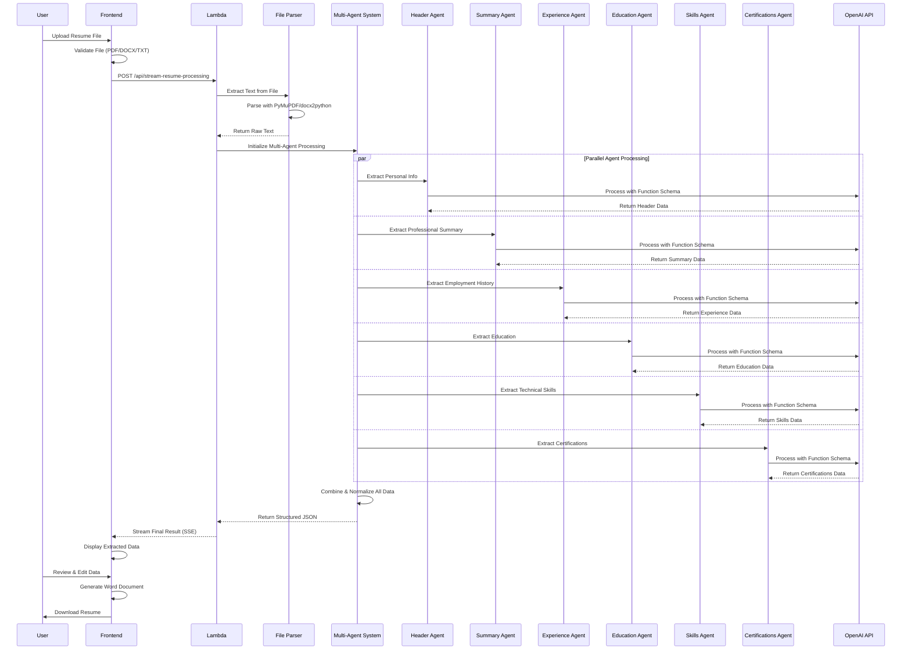
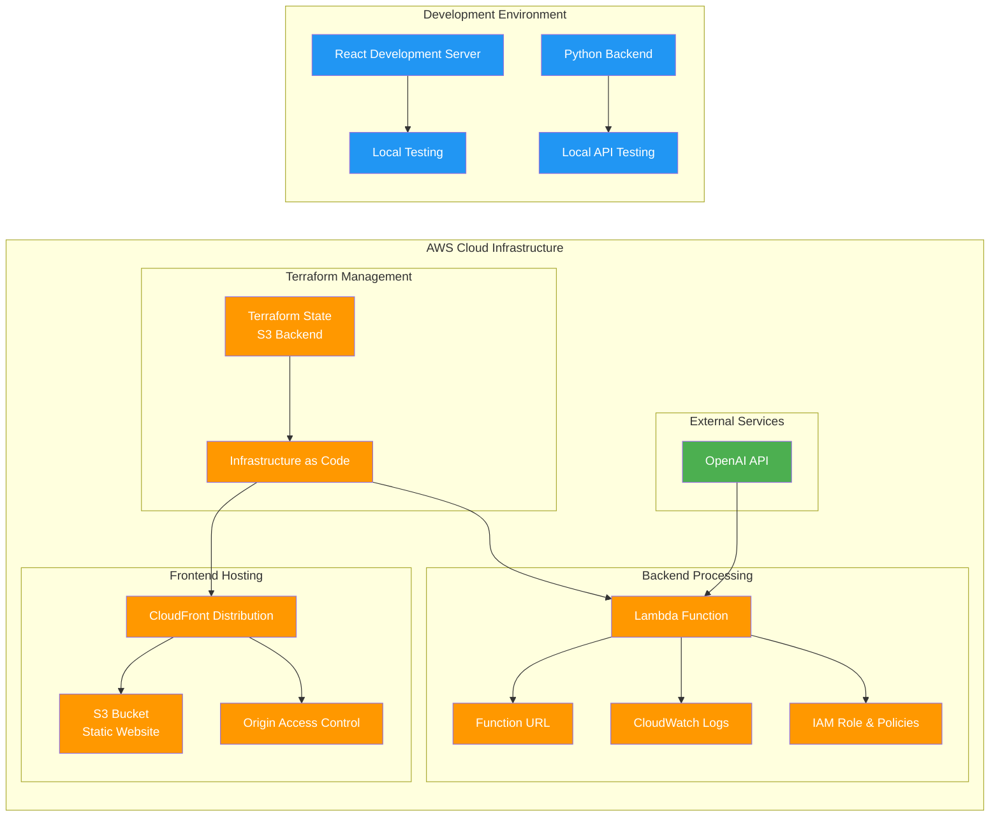
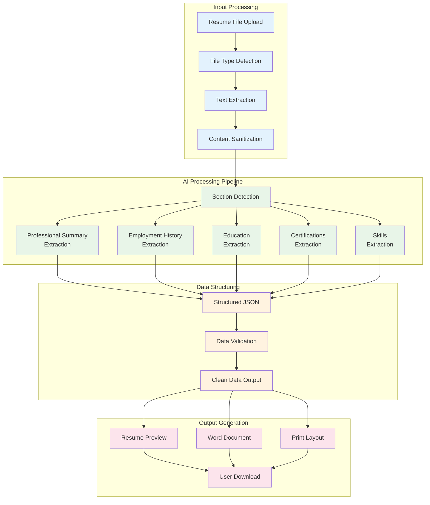

# Resume Builder Project Flow Diagram

## System Architecture Overview



## Detailed Multi-Agent Processing Flow



## Infrastructure Components



## Data Flow Architecture



## Key Features & Technologies

### Frontend (React + Tailwind CSS)
- **FileUpload Component**: 
  - Drag & drop interface with react-dropzone
  - File validation (PDF/DOCX/TXT, max 10MB)
  - DOC file rejection with clear messaging
  - Server-sent events streaming for real-time progress
- **ResumeForm Component**: 
  - Comprehensive editing interface for all resume sections
  - Dynamic form fields with add/remove functionality
  - Nested structure support (projects, subsections, skill categories)
  - Real-time data validation and sanitization
- **GeneratedResume Component**: 
  - Live resume preview with professional styling
  - Word document generation using docx library
  - Print functionality with CSS print styles
  - Download options for multiple formats

### Backend (FastAPI + Python)
- **File Parser Module**: 
  - PyMuPDF for PDF text extraction
  - docx2python for DOCX processing
  - Plain text file support
  - Robust error handling and cleanup
- **Multi-Agent AI System**: 
  - 6 specialized agents for parallel processing
  - OpenAI GPT-4o-mini with function calling
  - Cache-busting for fresh AI responses
  - Intelligent chunking and section detection
- **Data Normalization**: 
  - Date format standardization (MMM YYYY)
  - Location format normalization (City, State)
  - Degree standardization (BS, MS, PhD)
  - Work period normalization with "to" → "-" conversion
- **Token Management**: 
  - Cost tracking and usage analytics
  - Efficient prompt engineering
  - Processing time monitoring

### Infrastructure (AWS + Terraform)
- **S3 Static Website Hosting**: 
  - CloudFront CDN distribution
  - Origin Access Control for security
  - Custom error pages for SPA routing
- **Lambda Serverless Backend**: 
  - Function URL for direct API access
  - 5-minute timeout for complex processing
  - Automatic scaling and cost optimization
- **Infrastructure as Code**: 
  - Terraform modules for reusable components
  - Environment-specific deployments
  - S3 backend for state management
- **CI/CD Pipeline**: 
  - GitHub Actions for automated deployment
  - Docker-based Lambda packaging
  - Automatic frontend build and deployment

### AI Processing Architecture
- **Specialized Agents**: 
  - Header Agent: Personal information extraction
  - Summary Agent: Professional summary with subsections
  - Experience Agent: Employment history with projects
  - Education Agent: Academic background with sorting
  - Skills Agent: Technical skills with hierarchical structure
  - Certifications Agent: Professional credentials
- **Advanced Features**: 
  - Parallel agent execution for speed
  - Hierarchical skills structure preservation
  - Project vs job-level content differentiation
  - Comprehensive data validation and cleaning

## Detailed Project Structure

```
ob-resume-builder-test/
├── frontend/                           # React SPA with Tailwind CSS
│   ├── src/
│   │   ├── components/
│   │   │   ├── FileUpload.js          # Drag & drop file upload with streaming
│   │   │   ├── ResumeForm.js          # Comprehensive resume editing interface
│   │   │   └── GeneratedResume.js     # Preview & Word document generation
│   │   ├── App.js                     # Main application with 3-step wizard
│   │   ├── index.js                   # React app entry point
│   │   └── index.css                  # Tailwind CSS imports
│   ├── public/
│   │   ├── index.html                 # HTML template
│   │   └── logo.png                   # OceanBlue Solutions logo
│   ├── package.json                   # Dependencies & build scripts
│   ├── tailwind.config.js             # Tailwind configuration
│   └── postcss.config.js              # PostCSS configuration
├── backend/                            # Python FastAPI backend
│   ├── utils/
│   │   ├── file_parser.py             # PDF/DOCX/TXT text extraction
│   │   ├── ai_parser.py               # Multi-agent orchestration
│   │   ├── resume_agents.py           # 6 specialized AI agents
│   │   ├── agent_schemas.py           # OpenAI function schemas
│   │   ├── chunk_resume.py            # Resume section detection
│   │   └── token_logger.py            # Cost tracking & analytics
│   ├── main.py                        # FastAPI application
│   ├── lambda_handler.py              # AWS Lambda wrapper (Mangum)
│   └── requirements.txt               # Python dependencies
├── terraform/                          # Infrastructure as Code
│   ├── modules/
│   │   ├── s3/                        # S3 static website hosting
│   │   ├── cloudfront/                # CDN distribution
│   │   └── lambda/                    # Serverless backend
│   ├── main.tf                        # Main Terraform configuration
│   ├── variables.tf                   # Input variables
│   └── outputs.tf                     # Output values
├── .github/workflows/
│   └── deploy.yml                     # CI/CD pipeline
├── .gitignore                         # Git ignore rules
├── setup.md                           # Setup instructions
└── project-flow-diagram.md           # This documentation
```

## Advanced Technical Implementation Details

### Multi-Agent AI Architecture
The system employs a sophisticated multi-agent approach where 6 specialized AI agents process different resume sections in parallel:

1. **Header Agent**: Extracts personal information (name, title, requisition number)
2. **Summary Agent**: Processes professional summary with nested subsections
3. **Experience Agent**: Handles employment history with intelligent project detection
4. **Education Agent**: Manages academic background with degree standardization
5. **Skills Agent**: Preserves hierarchical technical skills structure
6. **Certifications Agent**: Extracts professional credentials and licenses

### Data Normalization Pipeline
- **Date Standardization**: Converts all dates to "MMM YYYY" format
- **Location Formatting**: Standardizes to "City, State/Country" format
- **Degree Mapping**: Normalizes degrees (BTech→BS, MTech→MS, etc.)
- **Work Period Cleaning**: Handles em-dash, en-dash, and "to" conversions
- **Hierarchical Structure Preservation**: Maintains nested skills and subsections

### Performance Optimizations
- **Parallel Processing**: All 6 agents run simultaneously
- **Cache Busting**: Prevents OpenAI response caching for fresh results
- **Streaming Responses**: Real-time progress updates via Server-Sent Events
- **Token Optimization**: Cost-effective prompt engineering
- **Serverless Scaling**: Automatic Lambda scaling based on demand

This enterprise-grade resume builder demonstrates modern cloud-native architecture, combining React frontend, Python backend, multi-agent AI processing, and AWS infrastructure to deliver intelligent resume parsing and generation capabilities.
